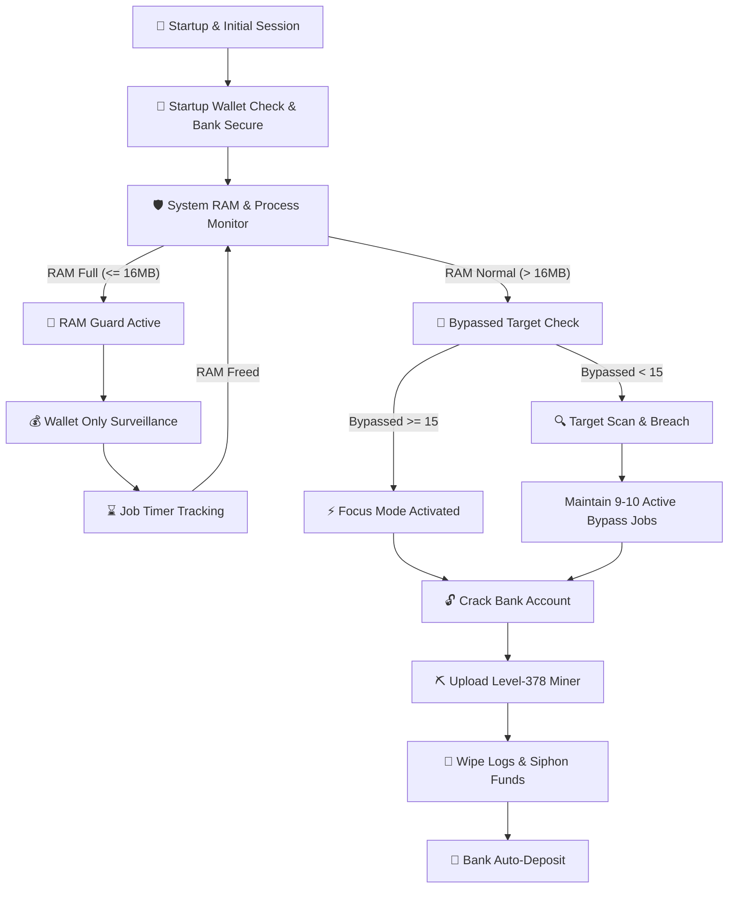

<div align="center">

# ⚡ LYOS AUTOMATED CYBER ENGINE ⚡
### *Autonomous, Self-Intelligent & Multi-Account Bot for LyOS Telegram MiniApp*

[](https://python.org)
[](https://github.com/sakfi/LyOs-Bot)
[](https://github.com/sakfi/LyOs-Bot)
[](LICENSE)

<br/>


</div>

---

## 🖥️ System Specifications & Telemetry

```yaml
System Specification: LYOS-CYBER-ENGINE
Engine Core Version: 6.1.175-LYOS-CYBER/v26.07.22-AUTONOMOUS
Framework: Python 3.10+ (AsyncIO / HTTPX)
Target Platform: LyOS Telegram MiniApp (https://lyos.fly.dev)

Core Hacking Modules:
- Autonomous Execution:
  - Startup Wallet Auto-Deposit (Immediate Vault Protection)
  - 1-Hour Vault Defense Loop (Background Cron Timer)
  - Self-Intelligent RAM Guard (Auto-Halt when RAM <= 16MB)
  - Dynamic Memory Recovery (Monitors job timers & freed RAM)
  - Bypassed Target Focus Mode (Prioritizes >= 15 Bypassed Targets)
  - Level-378 Miner Deployment (Auto-decrement 378 -> 1)
  - Anti-Forensics Log Erasure (Pre-siphon & Post-siphon Wiping)
- System Exploitation:
  - 9-10 Concurrent Active Bypass Jobs
  - High-Yield Target Filter (Reputation == 0 & Firewall >= 100)
  - Multi-Account Session Manager (Randomized Human Delays)

Live System Telemetry:
  [23:20:01] [+] SYSTEM_INIT: Loaded 1 account session token(s)
  [23:20:02] [✔] WALLET_GUARD: Transferred 45,000 funds -> In-Game Bank
  [23:20:05] [⚡] FOCUS_MODE: Detected 16 bypassed targets -> Cracking Banks & Miners
  [23:20:15] [!] RAM_ALERT: Memory full (12MB free). Halting scans -> Monitoring job timers
  [23:20:45] [✔] RAM_RECOVERED: 128MB free memory restored -> Resuming core operations
```

---

## 🛰️ Cyber System Architecture



---

## ⚡ Core Hacking Capabilities Matrix

| Feature Module | Description | Technical Mechanism |
| :--- | :--- | :--- |
| 🛡️ **Self-Intelligent RAM Guard** | Hardware memory protection | Halts operations when RAM $\le 16$ MB. Runs wallet surveillance & resumes automatically upon RAM release. |
| 🏦 **Automated Vault Protection** | Financial safety & auto-deposit | Immediate startup deposit + background 1-hour periodic schedule (`3600s`). |
| 🎯 **Bypassed Target Focus Mode** | Dedicated exploitation | Auto-detects $\ge 15$ bypassed targets and pauses scanning to prioritize Bank Cracks & Miners. |
| ⛏️ **Highest-Level Miner Upload** | Income yield optimization | Attempts **Level 378** miner deployment; auto-decrements levels ($378 \rightarrow 1$) on failure. |
| 🔍 **Precision Target Discovery** | High-value target filtering | Filters for **`Reputation == 0`** & **`Firewall Level >= 100`** across 5-target scan batches. |
| 🔒 **Anti-Forensics Log Wipe** | Trace sanitization | Double log-cleaning protocol (pre-siphon and post-siphon) to ensure total anonymity. |
| 🔄 **Multi-Account Orchestration** | Asynchronous session manager | Handles infinite account rotation with randomized human-like delays. |

---

## ⚙️ Installation & Deployment

### 1. Repository Setup

```bash
# Clone the repository
git clone https://github.com/sakfi/LyOs-Bot.git

# Navigate into project directory
cd LyOs-Bot

# Install required Python packages
pip install -r requirements.txt
```

---

### 2. Extract Session Token (`Cookie`)

1. Open **Telegram Web** (`web.telegram.org/a/` or `/k/`) in your browser.
2. Launch the **LyOS MiniApp**.
3. Press **`F12`** (or `Right-Click -> Inspect`) to open Developer Tools.
4. Go to the **Network** tab.
5. Click any action inside the game (e.g., click **SCAN** tab).
6. Click any request (`system`, `scan`, `me`, `processes`) in the Network list.
7. Under **Request Headers**, copy the full **`Cookie`** string (starts with `__Secure-next-auth.session-token=...`).

---

### 3. Configure `data.txt` & `config.json`

Add your extracted session cookie into `data.txt` (one per line):
```text
__Secure-next-auth.session-token=eyJhbGciOiJDIR...
```

Customize execution parameters in `config.json`:
```json
{
  "auto_tap": true,
  "auto_claim_farming": true,
  "auto_daily_checkin": true,
  "auto_complete_tasks": true,
  "tap_count_range": [30, 80],
  "delay_between_accounts_seconds": [3, 7],
  "loop_delay_minutes": [120, 120]
}
```

---

### 4. Execute Cyber Engine

```bash
python main.py
```

---

## 📜 Disclaimer & License

This project is created strictly for **educational and game automation testing purposes**. Use responsibly.

Distributed under the **MIT License**. See '[LICENSE](LICENSE)' for more information.

<div align="center">
  <sub>Built with ❤️ by <a href="https://github.com/sakfi">Sakfi</a></sub>
</div>
